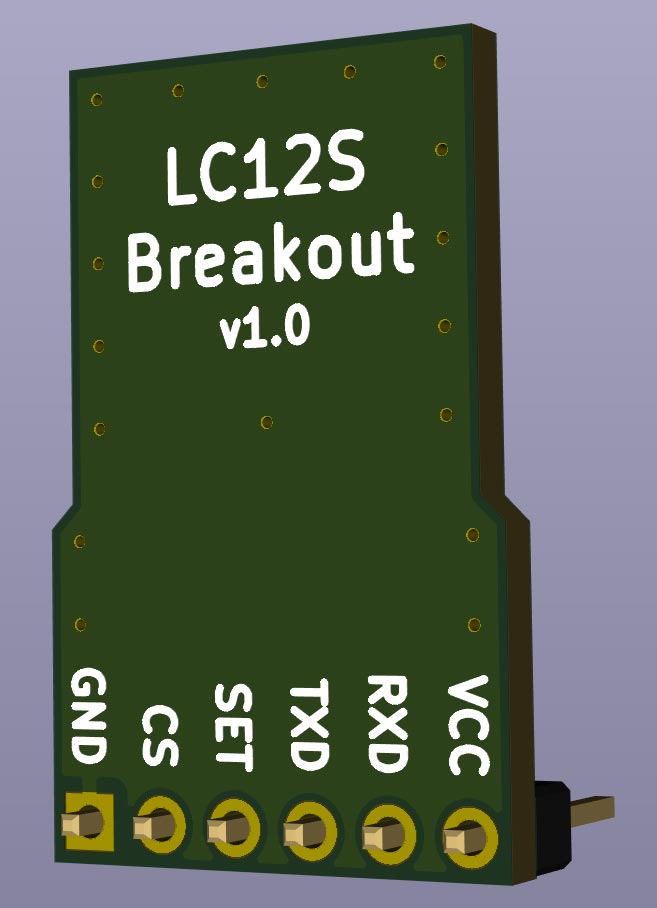
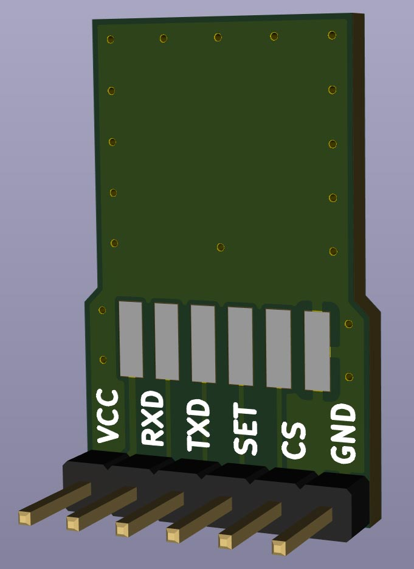
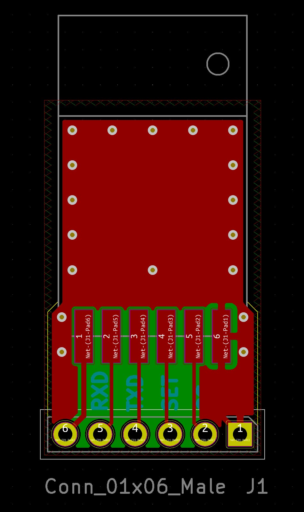
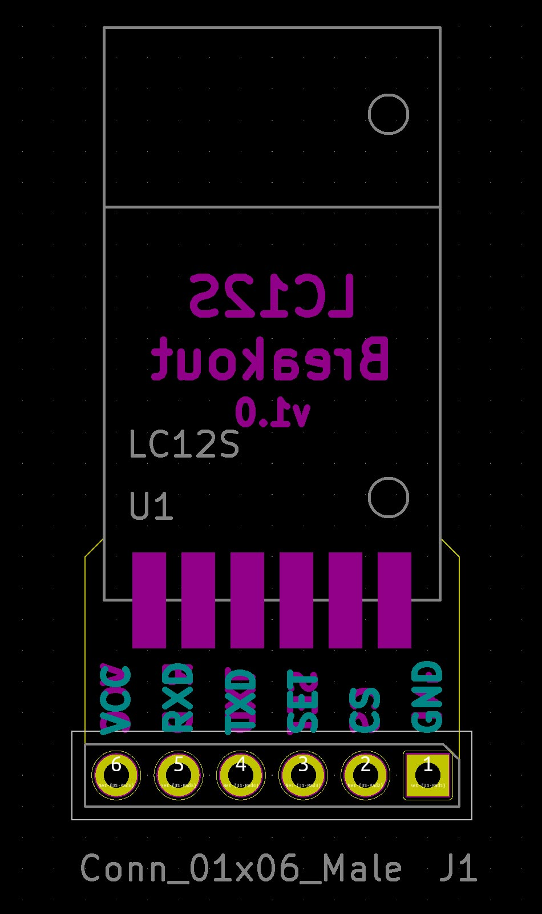
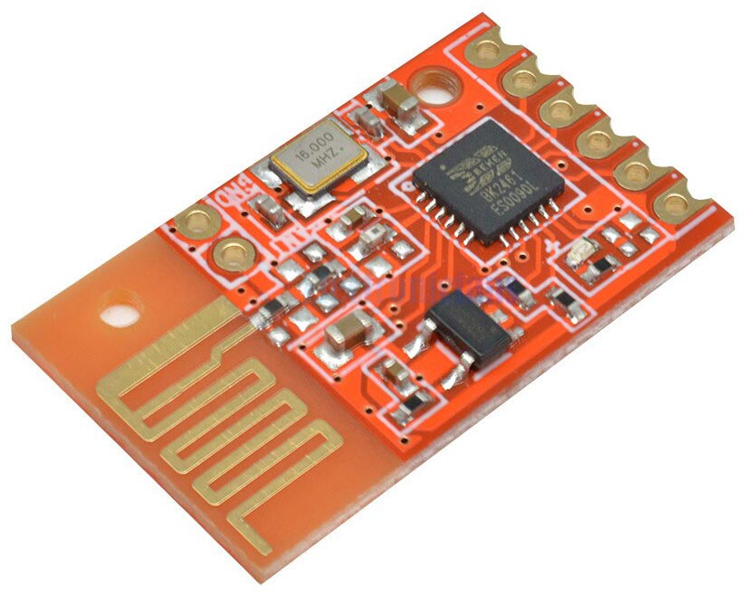
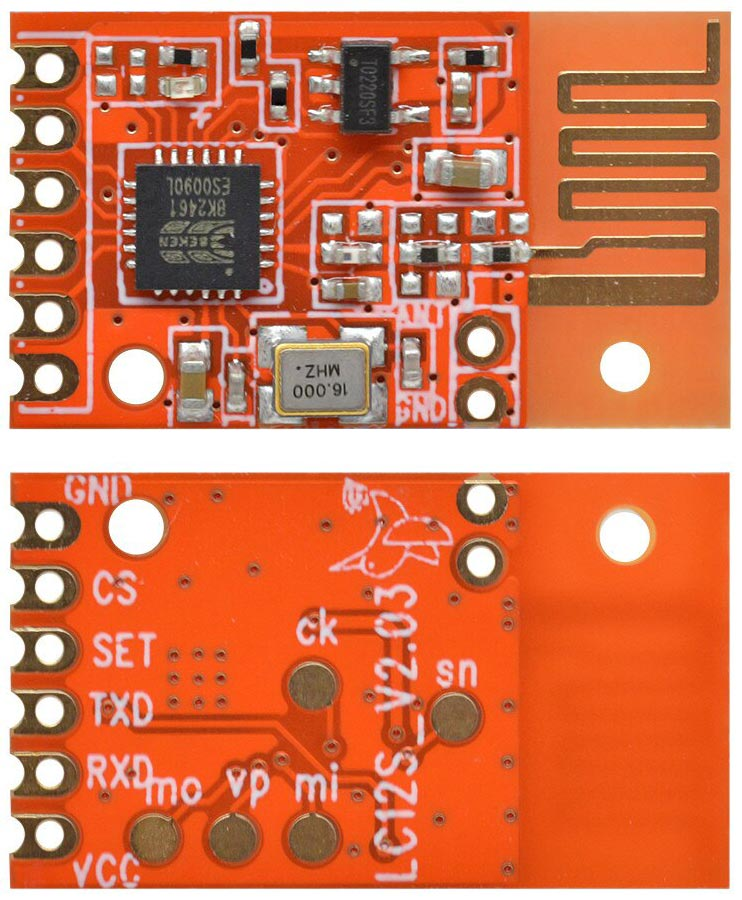
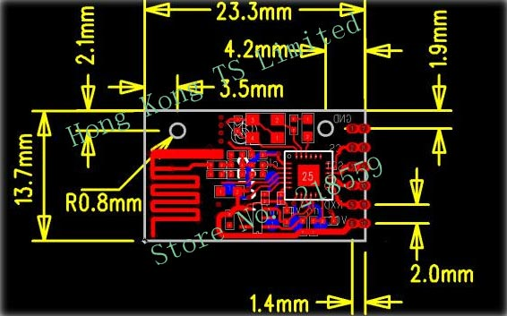
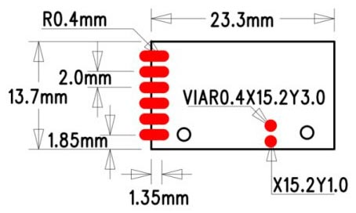

# LC12S Breakout

Breakout board for the [LC12S 2.4Ghz UART transceiver module](https://www.aliexpress.com/item/4001245739894.html).

Order the board from OSH Park here: <https://oshpark.com/shared_projects/yovxALwf>

3x boards for $2.85 (2 oz copper, 0.8mm thickness)

Only component you need is 1x6 straight or right-angle 2.54mm headers.

Designed using [KiCad 5](http://kicad-pcb.org/).

# OSH Park Purple PCBs

(will add images here once they arrive)

# Models

# PCB

# LC12S module

# Links

* [LC12S 2.4Ghz UART transceiver module](https://www.aliexpress.com/item/4001245739894.html)
* [Order the board on OSH Park](https://oshpark.com/shared_projects/yovxALwf)

# License

Licensed under the [MIT License](http://opensource.org/licenses/MIT).
